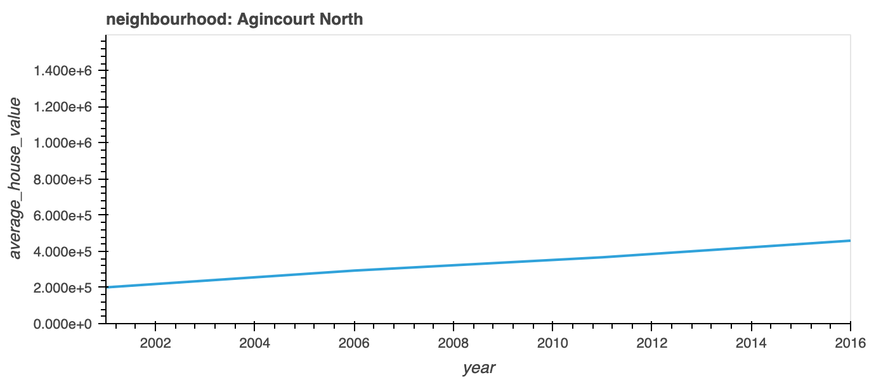
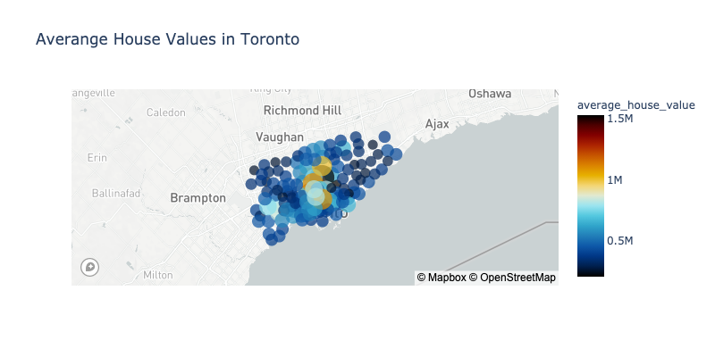

# Week6_HomeWork
Pythonic Monopoly 

## Background

>Harold's company has just started a new Real Estate Investment division to provide customers with a broader range of portfolio options. Harold was tasked with building a prototype dashboard, and he needs your help. The real estate team wants to trial this initial offering with investment opportunities for the Toronto market. If the new service is popular, then they can start to expand to other markets.
This dashboard's goal is to provide charts, maps, and interactive visualizations that help customers explore the data and determine if they want to invest in rental properties in Toronto.

In this homework assignment, you will help Harold accomplish the following tasks:
- Complete a notebock for renatal analysis
- Create a dashboard for visulaisation to explore market data

## Rental Analysis

# Preparation

# Import all dependencies

	- Warnings : warning control 
	- Panel : a high level APP for dashbaording solution for python
	- plotly : open source graphing library
	- Pandas : open source data analysis and manipulation tool
	- hvplot  : A high level plotting API for the PyData ecosystem built on Holoviews
	- matplotlib : a comprehensive library for creating static, animated, and interactive visualisations in Python.
	- os : Miscellaneous operating system interfaces
	- pathlib : object oriented filesystem paths
	- dotenv : to read key-value pairs from .env file (environment variables)

2. Load the environment and reading the map box API
3. Load the data as provided through the CSV file and create a data frame

*Dwelling Types per Year*

In this section we will calculate the number of dwelling types per year. Visualise the results using bar charts and pandas plot function. Each year will be rendered using a different colour for more visibility.

4.  Using “grouby” , calculate the sum of dwelling types units creating a new data frame
5. Convert the new data frame into a new CSV file using the “to_csv” function
6. Define a function to help in plotting the bar charts. This is useful to create a reusable code and reduce the amount of code required to create a chart per year
7. Call the bar chart plotting function created in the previous cell for each year with parameters, year, title , x axis label, y axis label, and color.

*Average Monthly Shelter costs in Toronto per year*

>In this section we will calculate the average monthly shelter cost for owned , and rented dwellings and visuals the results using line charts

8. Calculate the average monthly cost for owned and rented dwelling using “mean” and “groupby”
9. Define a function to be called that will help in creating the required line charts
10. Call the function using parameters, data frame , title, x axis label, y axis label, and color

*Average House Value Per year*

>In this section, we want to determine the average house value per year. The objective is to determine the time required to hold the rental property and to decide either to buy or rent. The data will be visualised in a bar chart format.

12. Calculat the average house value per year using “mean” and “groupby”
13. Plot the bar chart for the average house value over the years using the predefined functions from cell 9

*Average house value by neighbourhood*

>In this section, we will use hvplot to create an interactive visualisation of the average house value with a dropdown selector for the neighbourhood. For simplicity we will create a new data frame from grouping the data and calculating the mean house values for each year and neighbourhood.

14.  Create a new DataFrame with the mean house values by neighbourhood per year. 
15. Using hvplot, create an interactive line chart , in this chart the user can use the drop down feature to select what neighbourhood he’s interested in.

<Insert Image Cell15>

*Number of Dwelling types per year*

>In this section, we will use hvplot to create an interactive visualisation of the average number of dwelling types per year with a dropdown selector for the neighbourhood.

16. Fetch all the data from the initial data frame “to_data” and using “groupby” to group the data by year and neighbourhood.

17. Using hvplot, create an interactive bar chart <Cell17 image>

*Top 10 most expensive neighbourhoods*

18. Get the data for the most expensive top 10 neighbourhoods using the following line of code 

>top_10_expensive_neighbourhoods = to_data.groupby(['neighbourhood']).mean().reset_index().sort_values(by=['average_house_value'],ascending=False).head(10).reset_index(drop=True)

19. Using hvplot create an interactive bar chart for the  top 10 most expensive neighbourhoods 
	

*Neighbourhood Map*

20. Loading location data from the provided csv file 

file_path = Path("Data/toronto_neighbourhoods_coordinates.csv")
df_neighbourhood_locations = pd.read_csv(file_path)
 
21. Calculate the mean value for each neighbourhood

22. Join the average values with the neighbourhood locations 

>neighbourhood_df = pd.merge(df_neighbourhood_locations,avg_by_neighbourhood,on='neighbourhood',how='inner')
neighbourhood_df.head()

*MapBox visualisation*

23. Using plotly.express scatter_mapbox visualisation to create plot for average value per neighbourhood

*Cost Analysis*

>In this section, we will use Plotly express to a couple of plots that investors can interactively filter and explore various factors related to the house value of the Toronto's neighbourhoods.

  

### Dashboard

  > In this notebook we will compile the visualisations from the previous analysis into functions to create a Panel dashboard.

> The interactive images rendered as output cells after calling hvplot function. Here is the resulted dashboard, that can be shown when running the notebook.
  

 

  

  

	

